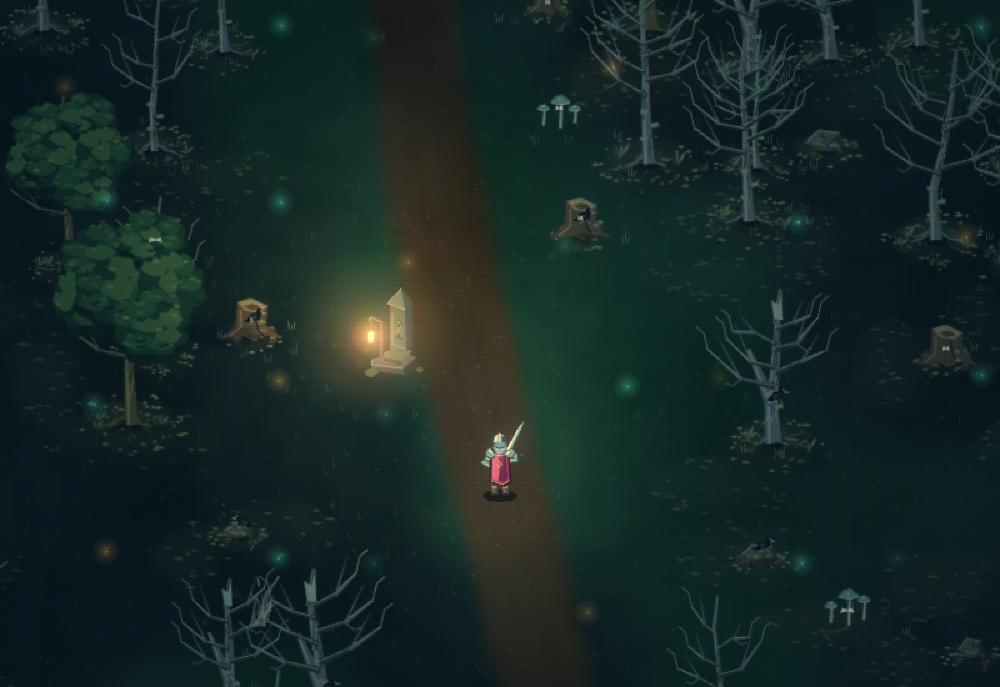
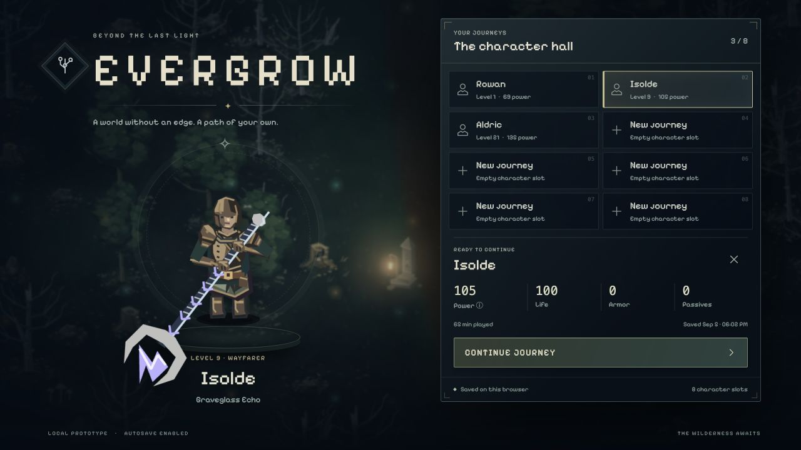
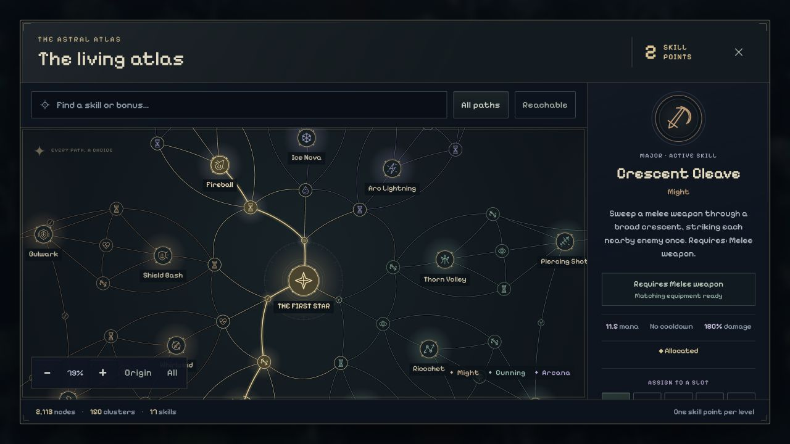
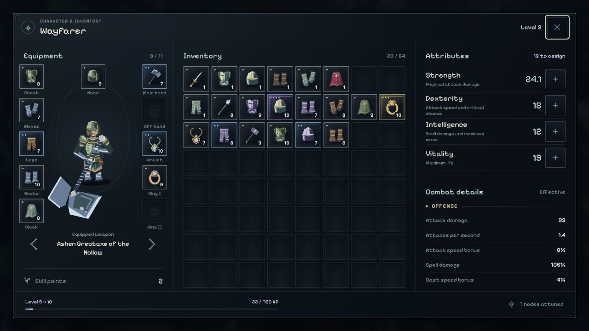

# Evergrow

A gothic, top-down 2D action RPG built for the browser, inspired by Diablo and Path of Exile. Explore a growing wilderness, find gear, and build a character across a vast classless skill tree.

**Status: playable local prototype · actively iterating · not released.**



## What works today

- **Characters & saves:** eight local save slots, a forest character hall, equipped previews, level/power summaries and automatic checkpoints. Every character starts with leather armor, a choice of sword, bow or fire staff, and an empty bag.
- **World:** seven blended biomes, procedural towns with walk-in interiors, camps and landmarks, day/night lighting, wind and ambient wildlife. Scrolling minimap and an explored-world atlas.
- **Combat:** melee, bows and elemental staves; shields and dual wield; dodging, particles, damage feedback, and six enemy archetypes across three ranks. Encounters spawn outside the camera.
- **Builds:** 2,113 nodes, 150 constellations and 17 active skills. Short early routes, useful resource/speed choices, and cross-discipline bridges at every layer. Attack and cast speed are independent; first-tier skills have no cooldown.
- **Gear & progression:** procedural names, icons and visible equipment; an 8×8 inventory, drag/drop, quick equip and comparison tooltips; item tiers, enemy loot tables, geographic danger scaling, and one skill point plus five attribute points per level.
- **Presentation:** code-generated artwork, dynamic lighting, restrained CRT/phosphor, and a shared retro-modern UI kit with compact panels, readable rarity treatments and animated tooltips, fading enemy remains, labeled ground equipment, rarity-colored loot notifications, level-up rewards and discovery notices.

Character progress and each character’s explored map persist in this browser. Trading, crafting, quests, respecs and cloud saves are still to come. Endless progression is the direction, not a finished endgame.

## Screenshots

Current game renderers and interfaces, captured from frozen development scenes on September 5, 2026. Equipment and allocations are staged; no gameplay was automated.



| Skill tree · early choices | Character & inventory |
| --- | --- |
|  |  |

[View the complete skill atlas](docs/screenshots/skill-atlas.png).

## Run locally

Requires **Node.js 22.13+**.

```sh
npm run setup
npm run dev
```

Open [localhost:5173](http://127.0.0.1:5173/) in your browser. The server binds to your machine only.

**WASD** move · **mouse** aim · **LMB** basic attack · **RMB / 1–4** skills · **Space** dodge · **Q** potion · **C/I** character · **T** tree · **M** map. [All controls](docs/controls.md).

```sh
npm run check   # Code tests, strict TypeScript checks, production build
npm run stats   # Content, source and build statistics
```

TypeScript, Vite, Canvas 2D and WebGL; no runtime package dependencies. **492 code tests pass** at this checkpoint. Gameplay feel and balance are tested by the player.

Gold drops magnetize on approach, persist per character, and appear in the HUD and inventory. Gold and XP gains have compact animated feedback.

[Character saves](docs/character-saves.md) · [Game brief](docs/game-brief.md) · [Roadmap](docs/roadmap.md) · [Architecture](docs/architecture.md) · [Skills & weapons](docs/weapons-and-skills.md) · [Progression & loot](docs/progression-and-loot.md) · [NPC & vendor spec](docs/npcs-and-vendors.md)

World, character and equipment art is generated in code. The bundled [Pixelify Sans font](game/src/assets/fonts/SOURCE.md) is licensed under the SIL Open Font License.
