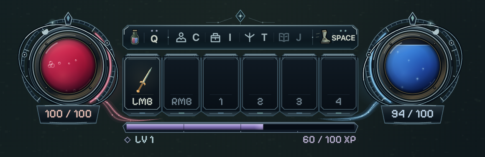
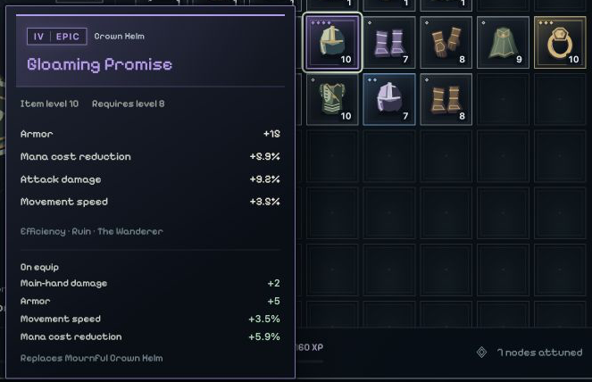
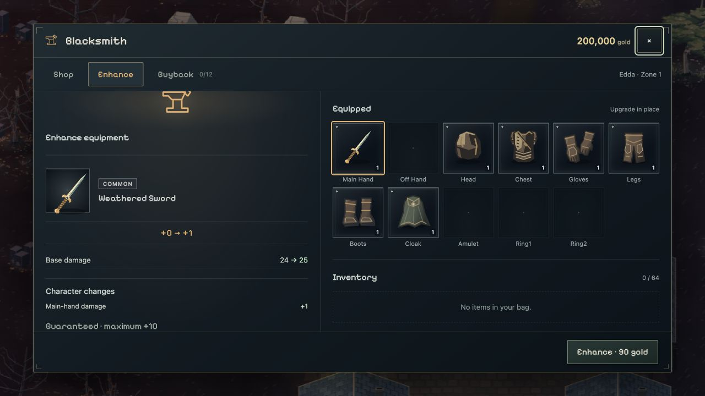

# Evergrow

A gothic, top-down 2D action RPG built for the browser, inspired by Diablo and Path of Exile. Explore a growing wilderness, find gear, and build a character across a vast classless skill tree.

**Playable prototype · actively iterating · not released.**

## Play

### [Play Evergrow in your browser →](https://evergrow.dimillian.chatgpt.site)

Play on desktop with keyboard and mouse, or [run it locally](#run-locally).

Progress is saved in your browser. Hosted and localhost characters have separate saves; cloud saves are not available yet.


## What works today

- **Characters & saves:** eight local save slots, a forest character hall, equipped previews, level/power summaries and automatic checkpoints. Every character starts with leather armor, a choice of sword, bow or fire staff, and an empty bag.
- **World:** seven blended biomes, procedural towns with walk-in interiors, camp strongboxes, caravan choices, beacons, guardian trials and roadside loot, day/night lighting, wind and ambient wildlife. Scrolling minimap and an explored-world atlas.
- **Combat:** melee, bows and elemental staves; shields and dual wield; dodging, particles, damage feedback, and six enemy archetypes across three ranks. Encounters spawn outside the camera.
- **Builds:** 2,185 nodes, 150 passive constellations and 20 active skills. Short early routes, useful resource/speed choices, and cross-discipline bridges at every layer. Upgradeable skill ranks, deeper specializations and three Arcana ultimates. First-tier skills stay cooldown-free.
- **Gear & progression:** procedural names, icons and visible equipment; an 8×8 inventory, drag/drop, quick equip and comparison tooltips; item tiers, enemy loot tables, geographic danger scaling, and one skill point plus five attribute points per level.
- **Presentation:** code-generated artwork, dynamic lighting, restrained CRT/phosphor, a shared retro-modern UI kit, and compact loot, gold, XP and discovery notifications.

**Town portal:** free three-second cast to your home town, with a saved return portal back to your expedition. Set home at a town plaza anchor.

**Town services:** procedural blacksmiths, jewelers and enchanters; buy/sell/buyback, upgrade gear to +10, raise rarity, reroll affixes and raise item level. Equipped gear can be improved in place.

Character progress, shop state and each character’s explored map persist in this browser. **Save format v3 requires a new character for older saves; old slots remain stored.** Quests, respecs and cloud saves are still to come. Endless progression is the direction, not a finished endgame.

## Screenshots

Real game interfaces and renderers, captured from frozen development scenes on September 5, 2026. Characters, equipment and resources are staged.

### Combat HUD

Animated life and mana glass, a compact shortcut rail, five assignable skill slots, and an integrated XP bar. UI and text stay crisp above the world’s CRT effects.



### Loot & item details

Distinct rarity borders and crests, procedural equipment icons, readable affixes, and effective stat comparisons before equipping. The bag holds 64 items and supports drag/drop and quick equip.



### Town services

Trade with blacksmiths, jewelers and enchanters. Improve gear to +10, raise rarity, reroll affixes or bring a favorite item up to the area's level—including equipped gear.



### Characters & builds


| Skill tree · early choices | Character & inventory |
| --- | --- |
|  |  |

[View the complete skill atlas](docs/screenshots/skill-atlas.png) · [Town service captures](docs/captures/2026-09-05/town-services/README.md).

## Run locally

Requires **Node.js 22.13+**.

```sh
npm run setup
npm run dev
```

Open [localhost:5173](http://127.0.0.1:5173/) in your browser. The server binds to your machine only.

**WASD** move · **mouse** aim · **LMB** basic attack · **RMB / 1–4** skills · **Space** dodge · **Q** potion · **E** interact · **P** town portal · **C/I** character · **T** tree · **M** map. [All controls](docs/controls.md).

```sh
npm run check   # Code tests, strict TypeScript checks, production build
npm run stats   # Content, source and build statistics
```

`npm run build:site` prepares the production game in root `dist/` for Sites. Deployment uses the existing project in `.openai/hosting.json`; local development remains unchanged.

TypeScript, Vite, Canvas 2D and WebGL; no runtime package dependencies. **519 code tests pass** at this checkpoint. Gameplay feel and balance are tested by the player.

[Documentation index](docs/README.md) · [Current status](docs/system-status.md) · [Character saves](docs/character-saves.md) · [Game brief](docs/game-brief.md) · [Roadmap](docs/roadmap.md) · [Architecture](docs/architecture.md) · [Skills & weapons](docs/weapons-and-skills.md) · [Progression & loot](docs/progression-and-loot.md) · [NPC services](docs/npcs-and-vendors.md)

World, character and equipment art is generated in code. The bundled [Pixelify Sans font](game/src/assets/fonts/SOURCE.md) is licensed under the SIL Open Font License.
