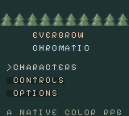

# Evergrow Chromatic

A local native Game Boy Color adaptation of Evergrow, built as a genuine GB Studio project with a project-local C engine scene. The ROM runs on a ModRetro Chromatic or a compatible GBC emulator. The browser game remains a separate application.

Open `project.gbsproj` to edit the cartridge project. Native rules and rendering live in `plugins/evergrow/engine/`; `tools/export-content.mjs` reads the main game's current weapon, focus and active-skill content. This is a native prototype undergoing a quality pass, with human gameplay and physical cartridge acceptance still pending.



## Build

Prepare the **build** dependencies through the installed ModRetro Chromatic plugin. This project uses official GB Studio 4.3.2 and GBDK 4.5.0. From the repository root:

```sh
npm run chromatic:build
```

This exports source content, runs the native rules checks with AddressSanitizer and UndefinedBehaviorSanitizer, compiles the editable project with the official CLI, and checks the ROM header and global checksum. Output:

- `chromatic/build/evergrow-chromatic.gbc`
- `chromatic/build/manifest.json`

The build script discovers the plugin's stable toolchain location on macOS, Linux and Windows. `GB_STUDIO_SETUP_ROOT` preserves an explicitly configured toolchain; `EVERGROW_GBSTUDIO_CLI` can select another official CLI. The rules runner requires a C compiler supporting the sanitizers (`CC` selects it). On Windows use a suitable Clang environment for these checks.

For the local emulator preview, select `chromatic/project.gbsproj` in the ModRetro Chromatic plugin and open its web preview. The plugin compiles the actual ROM and runs its genuine emulator. Keep official builds sequential because GB Studio uses a shared temporary build directory.

Artwork is already generated and checked in. To regenerate it, use Python with Pillow:

```sh
EVERGROW_PYTHON=/path/to/python npm run chromatic:art
```

The generator authors exact 2bpp tiles and sprite silhouettes, rasterizing the repository's licensed Pixelify Sans lettering and Barlow numerals. Editable reference atlases are in `art/`; their C representation is `ev_art.c`. No remote art service is needed.

## Controls

| Chromatic | Action |
| --- | --- |
| D-pad | Move; face and aim |
| A | Basic attack; interact near a service, doorway, hearth, shrine or stairs |
| B | Use the selected assigned skill |
| Tap Select | Cycle the five skill slots |
| Select + A | Dodge |
| Select + B | Shared life/mana potion |
| Start | Pause and open character menu |
| Menu A / B | Confirm / back |
| Menu arrows | Navigate; left/right page lists or select a skill slot |
| Atlas Select | Next territory |
| Skill list Select | Purchase the selected skill's next rank |

Start opens a paused menu; Start resumes from any character panel, while B returns to the previous panel and selection. Hold a direction to scroll lists. Buttons used to close a panel must be released before they can act in the world.

The plugin browser preview displays its own keyboard bindings: arrows, **Z** for A, **X** for B, **P** for Select and **Enter** for Start. New characters begin with five empty skill slots. Unlock skills in the atlas, then assign them in Skills and Ranks. Incompatible equipment disables a skill without removing the assignment.

## First expedition

Choose one of eight character slots and one of six starter loadouts. Your home is a tent settlement with merchants, a hearth, a gambler and personal storage. Walk out along any road, defeat encounters, gather loot and spend level-up points. Return through Home Portal in the pause menu; casting takes three seconds and damage or movement cancels it. The same menu action returns you to your saved expedition location.

Explore the chart to find other towns, shrines, trials, lairs and ruins. Village/city houses are enterable; home has no houses. Ruins contain five floors with persistent casualties. At level 20 the town rift fixture opens repeatable expeditions with rising threat. The enchanter offers an atlas reset that refunds allocated nodes and skill ranks.

## Cartridge saves

Eight separate characters share **32 KB battery-backed SRAM**, matching the ROM header. A character contains progression, gear, 96 storage entries, exploration, encounter deaths, shop state, ground loot and expedition records. Save recovery uses CRC-checked primary records and a shared write-ahead journal. Before reusing the journal, the previous interrupted primary is repaired. Unsupported versions remain visible and require an explicit slot erase before replacement.

Use the same cartridge/save file when updating the ROM. Cartridge SRAM and emulator saves are separate from browser IndexedDB; browser characters cannot be imported into this native format. The prototype save schema is version 1. Changes to the packed payload require a deliberate schema decision.

See [native implementation and limits](../docs/chromatic.md) for exact coverage, storage bounds, verification and remaining acceptance work. The minimal workshop assets retained from the blank-project factory only provide valid editor resource references; native rendering replaces them at boot. Their upstream project-format license is preserved in `LICENSE`.
