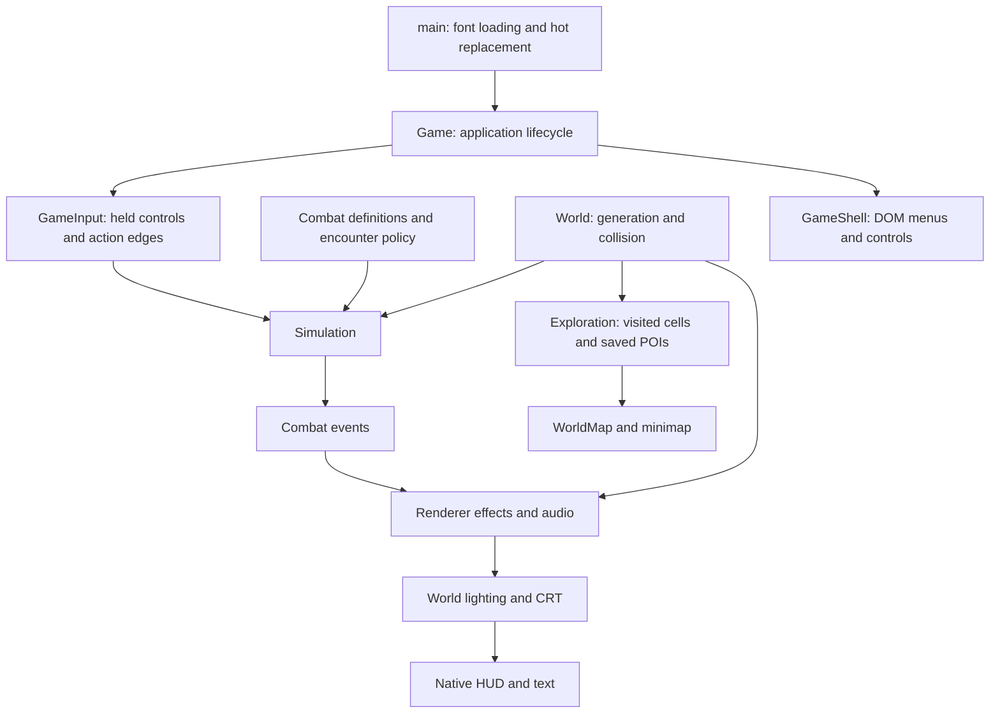

# Implemented architecture

Updated 2026-09-05. This describes the local prototype as implemented; `technical-foundations.md` contains the broader design proposals.

## Ownership and dependency direction

The application has four main boundaries: deterministic rules, generated world content, presentation, and browser integration. Combat must remain usable without a browser. Presentation consumes simulation state and events; it never decides damage, collisions, rewards, or attack timing.

| Owner | State and responsibilities | Lifetime |
| --- | --- | --- |
| `Simulation` | Player, enemies, projectiles, pickups, RNG, fixed clock, input buffers, combat events | Resets for a new run |
| `combat-content`, `equipment`, `encounter-director` | Authored balance, starter weapon, encounter composition and attack concurrency | Immutable definitions; actor equipment is copied |
| `World` | Seed, procedural queries, immutable cached settlement blueprints, terrain cache | One world instance; disposed by the application |
| `Exploration` | Visited cells, discovered POIs, schema validation, storage status and delayed writes | Survives new runs; flushes on teardown/page hide |
| `Renderer` | Camera, visible scene cache, art libraries, roof fades, lighting, hit trails, particles, focus | Visual state resets on a new run |
| `PostFX` / `GameAudio` | GPU targets and listeners / audio graph and voices | Explicit disposal |
| `GameInput` | Held keys/buttons, single-use action edges, pointer projection | Cleared on pause, map, blur, cancellation, restart |
| `GameShell` | DOM surface, accessible controls, menu listeners and toast timer | Explicit disposal; old menu listeners abort on replacement |
| `Game` / `Lifetime` | Phase, event routing, frame scheduling, construction rollback, reverse-order resource teardown | One application instance per hot replacement |

Generated buildings are frozen blueprints. Future shop inventories, opened chests, NPCs, and other mutable world state should be stored separately by stable identity, without editing geometry shared by collision, maps, and drawing.

## Where to extend

**Combat content:** `combat-content.ts` owns player action timing/costs, enemy stats and supported attack behaviors, projectile parameters, and pickup rules. `encounter-director.ts` owns spawn pacing, progression thresholds, population targets, and concurrent attack slots. `combat-geometry.ts` owns sector/swept-contact math. `Simulation` executes those rules in a fixed order. HUD cooldowns, casting effects, player pose timing, enemy names, and melee telegraphs now consume the same definitions.

Adding an enemy requires a typed `EnemyKind`, its definition, art dispatch, hover bounds, and intended encounter policy. The exhaustive definition/art records make omissions visible to TypeScript. An enemy can reuse melee or projectile behavior; genuinely new attack behavior belongs in the simulation and needs contact/cancellation tests. This is an explicit combat model, not yet a general skill scripting framework.

**Character assets:** `art.ts` remains a small compatibility entrypoint. `art-types.ts` defines poses and outfit layers; `art-primitives.ts` provides drawing/math helpers; `prop-art.ts` owns finite prop variants. `equipment-art.ts`, `character-motion.ts`, `player-art.ts`, and `enemy-art.ts` separate materials, attachment geometry, animation, and actor drawing. Add armor through the existing piece/mount definitions. The rig, sword trail, sparks, and weapon light must continue to share the same pose and blade position.

**Terrain and settlements:** biome weights, road contours, stone detail, sampled ground colors, layout blueprints, and building drawing have separate owners. `world-query.ts` bounds work before cell enumeration. `SceneVisibility` owns only the current padded viewport and invalidates on world changes and zoom. `GroundLayer` still stitches terrain tiles before subpixel sampling. New biome or layout changes need seed reproducibility, boundary, corridor, and entrance checks. Change generation version only when saved discoveries would no longer describe the generated world.

**Maps and saving:** `world-pois.ts` provides one POI kind registry for generation, saved-data validation, and map labels/colors. `map-view.ts` contains projection, zoom and coordinate bounds. `exploration-save.ts` validates a whole payload before any live merge. Keep character saves separate from chart discovery. The existing schema remains 1 and world generation remains 3; this refactor does not reset exploration.

**Menus and input:** `main.ts` only boots the application. `Game` coordinates systems; `GameShell` accepts presentation values and callbacks, without reading simulation state. `GameInput` preserves short taps between frames and consumes them once. `isGameUIPoint` is shared by weapon suppression, hover focus and the cursor. Future panels must join that shared input boundary and clear simulation buffers when changing control context. Native HUD/text rendering stays above world post-processing.

**Interface kit:** `ui-theme.ts` supplies shared DOM and Canvas materials. `ui-kit.css` owns reusable window, button, slot, readout, tooltip, and scrolling treatments; screen styles own layout. `ui-icons.ts` supplies decorative SVGs, while `ui-components.ts` owns escaped markup and abortable dialog focus. `game-menu.ts` builds menus from presentation values. Read [the UI kit contract](ui-kit.md) before extending inventory or other panels. `/ui.html` reviews actual components at desktop/narrow sizes with a frozen renderer and memory-only exploration.

## Guardrails and verification

Run `npm run check` from the repository root. It runs all deterministic/code-level tests, strict TypeScript checks, a second core compilation without DOM or Node globals, and the production build. The core compilation prevents simulation and generation rules from quietly depending on browser APIs. Architectural tests reject runtime import cycles and combat imports outside that core boundary.

The compiler now rejects unused locals/parameters, missing returns, implicit overrides, and switch fallthrough in addition to strict typing. Public compatibility exports remain where previous modules exposed shared geometry, map helpers, and art types.

`npm run stats` reports current source/module counts, content counts, dependency counts, configured caps, and sizes from the last production build. It does not run gameplay or modify saved data. The static layout, rig, and HUD review pages remain development-only tools. Automated browser gameplay tests are excluded from `check`; the user controls playtesting in the in-app browser.

The refactor was compared against the previous implementation: 86,400 deterministic combat ticks across 12 scenarios matched actor/projectile/pickup state and events; 2,484 pose, equipment, rig and prop samples matched procedural drawing commands. These are compatibility checks, not GPU performance measurements or visual acceptance.

## Expansion limits

The current architecture is suitable for incremental additions at the prototype's population and cache budgets. It is not a claim of production readiness or arbitrary scale. Enemy separation and several contact queries still scan actor lists; large crowds will need measured profiling and spatial indexing. Terrain/art generation is synchronous on the main thread; worker generation should follow evidence of frame stalls. Origin rebasing or another precision strategy will be needed for truly unbounded coordinates.

Exploration uses bounded, best-effort localStorage. Read/merge/write preserves known discoveries and rejects corrupt payloads, but simultaneous writes from multiple tabs are not a transactional database. Before persistent character progression, add a versioned character-save model, migrations, recovery/export, and deliberate multi-tab ownership. Trading, inventory, skill trees and arbitrary skill execution remain separate work.
