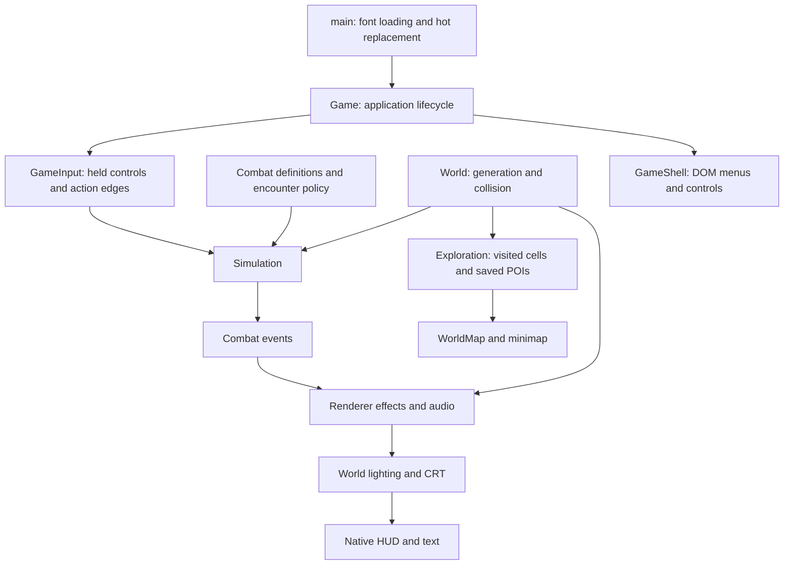

# Implemented architecture

Updated 2026-09-05. This describes the local prototype as implemented; `technical-foundations.md` contains the broader design proposals.

This game is unreleased and used only for the owner’s testing. Evolve systems directly: update callers and tests together, delete superseded code, and avoid compatibility wrappers, old-API guarantees, or migrations solely to support earlier prototype versions. Saved test progress may be invalidated when required by a change; report that consequence. Preserve history in Git, not parallel runtime implementations. Tests should protect the current intended behavior, not require obsolete features to survive.

## Ownership and dependency direction

The application has four main boundaries: deterministic rules, generated world content, presentation, and browser integration. Combat must remain usable without a browser. Presentation consumes simulation state and events; it never decides damage, collisions, rewards, or attack timing.

| Owner | State and responsibilities | Lifetime |
| --- | --- | --- |
| `Simulation` | Player, enemies, projectiles, timed ground effects, statuses, pickups, ground equipment, character sheet, RNG, fixed clock, input buffers, combat events | Resets for a new run |
| `combat-content`, `weapon-content`, `equipment`, `encounter-director` | Authored balance, weapon/shield profiles, starter equipment, encounter composition and attack concurrency | Immutable definitions; actor equipment is copied |
| `World` | Seed, procedural queries, immutable cached settlement/wilderness blueprints, terrain cache | One world instance; disposed by the application |
| `Exploration` | Visited cells, discovered POIs, schema validation, storage status and delayed writes | Survives new runs; flushes on teardown/page hide |
| `Renderer` | Camera, visible scene cache, art libraries, roof fades, lighting, hit trails, particles, focus | Visual state resets on a new run |
| `PostFX` / `GameAudio` | GPU targets and listeners / audio graph and voices | Explicit disposal |
| `GameInput` | Held keys/buttons, single-use action edges, pointer projection | Cleared on pause, map, blur, cancellation, restart |
| `GameShell` | DOM surface, accessible controls, menu listeners and toast timer | Explicit disposal; old menu listeners abort on replacement |
| `Game` / `Lifetime` | Phase, event routing, frame scheduling, construction rollback, reverse-order resource teardown | One application instance per hot replacement |

Generated buildings are frozen blueprints. Future shop inventories, opened chests, NPCs, and other mutable world state should be stored separately by stable identity, without editing geometry shared by collision, maps, and drawing.

## Where to extend

**Combat content:** `combat-content.ts` owns basic/utility timing, shared cast motion, level-one enemy stats and supported attack behaviors, projectile parameters, and resource-pickup rules. `encounter-director.ts` owns spawn pacing, area/biome composition, population targets, rank chances/caps, and concurrent attack slots. `combat-geometry.ts` owns sector/swept-contact math. `Simulation` executes those rules in a fixed order. HUD cooldowns, casting effects, player pose timing, enemy names, and melee telegraphs consume the same definitions.

Adding an enemy requires a typed `EnemyKind`, its definition, art dispatch, hover bounds, and intended encounter policy. The exhaustive definition/art records make omissions visible to TypeScript. An enemy can reuse melee, projectile or targeted-ground behavior. `enemy-ai.ts` owns sensing, last-seen memory, patrols, home return, flanking/ranged roles and committed aim. New attack behavior needs contact/cancellation tests; damage, projectile insertion and rewards stay simulation-owned. This is an explicit combat model, not yet a general skill scripting framework.

`camp-population.ts` retains exact run-local member records under stable camp/member IDs. Activating and sleeping groups obey actor/rank budgets; an approaching camp can reclaim slots from farther wholly offscreen garrisons or ambient actors. Sleeping preserves health, death state and reward sources. It cannot award XP or duplicate loot. The Game supplies current camera bounds to exclude ambient spawns from view. This is bounded local steering and streaming, not a navigation mesh or a world-wide AI simulation.

**Experience and rewards:** `progression-content.ts` owns numeric level bounds, monster/item multipliers, rank multipliers, and armor relative to the attacking source. `zone-progression.ts` derives fixed 3,200-unit geographic bands and immutable spawn-time stats. `progression.ts` owns current-level XP, the shared next-level curve, bounded exact overflow, and level-gap factors. The guarded enemy-death branch grants its captured XP once, using the player's pre-award level. `character.ts` grants one skill and five attribute points per gained level and refreshes the level-relative armor estimate without healing. New runs reset progression; character saving remains future work.

`loot-content.ts` owns rank gear counts/tier weights, archetype item-kind weights, and biome weapon/shield profile weights. `loot.ts` rolls a bounded source-level reward from the monster's isolated seed; it never reads player gear, player level, or combat RNG. `items.ts` receives the selected tier explicitly. Flat gear values and percentage budgets have different growth functions. Potions and resource pickups restore a fraction of the maximum resource. See [progression and loot](progression-and-loot.md) for current tables and limits. The development-only `/progression.html` study reads these same rules without running combat or accessing saves.

The renderer owns `ExperienceFeedback` for smoothing and pulses; the HUD reads player XP/level and never awards rewards. Enemy plates show source level/rank; map area inspection queries geographic danger only on revealed terrain. Projectiles retain their source level so armor resolution stays correct after the caster moves or dies.

**Character assets:** `art.ts` is currently a small entrypoint that can be removed or replaced as its callers evolve. `art-types.ts` defines poses and outfit layers; `art-primitives.ts` provides drawing/math helpers; `prop-art.ts` owns finite prop variants. `equipment-art.ts`, `character-motion.ts`, `player-art.ts`, and `enemy-art.ts` separate materials, attachment geometry, animation, and actor drawing. Add armor through the existing piece/mount definitions. `armor-shapes.ts` shares helmet, cuirass and pauldron shapes between the worn character and item icons. `weapon-shapes.ts` shares weapon and shield surfaces. Ground drops reuse that actual gear geometry through item-lifetime caches. The rig, sword trail, sparks, and weapon light must continue to share the same pose and blade position.

**Terrain and settlements:** biome weights, road contours, stone detail, sampled ground colors, layout blueprints, and building drawing have separate owners. `world-query.ts` bounds work before cell enumeration. `SceneVisibility` owns only the current padded viewport and invalidates on world changes and zoom. `GroundLayer` still stitches terrain tiles before subpixel sampling. New biome or layout changes need seed reproducibility, boundary, corridor, and entrance checks. Change generation version only when saved discoveries would no longer describe the generated world.

`wilderness-sites.ts` owns immutable camp, watchtower, graveyard, standing-stone and caravan layouts. `World` queries them once through bounded cell generation for rendering, collision, ambient-prop clearing and discovery. `wilderness-art.ts` draws ground before actors and decor in shared depth order. Combat lights receive the finite light budget before environmental lanterns. See [wilderness and encounters](wilderness-and-encounters.md) for the shared contracts and limits.

**Maps and saving:** `world-pois.ts` provides one POI kind registry for generation, saved-data validation, and map labels/colors. `map-view.ts` contains projection, zoom and coordinate bounds. `exploration-save.ts` validates a whole payload before any live merge. Keep character saves separate from chart discovery. `WorldMap.setCampStateReader` reads current run clearing state without adding it to saved exploration; dead garrisons get a distinct cleared marker and tooltip. The existing schema remains 1 and world generation remains 3; this refactor does not reset exploration.

**Menus and input:** `main.ts` only boots the application. `Game` coordinates systems; `GameShell` accepts presentation values and callbacks, without reading simulation state. `GameInput` preserves short taps between frames and consumes them once. `isGameUIPoint` is shared by weapon suppression, hover focus and the cursor. Future panels must join that shared input boundary and clear simulation buffers when changing control context. Native HUD/text rendering stays above world post-processing.

**Interface kit:** `ui-theme.ts` supplies shared DOM and Canvas materials. `ui-kit.css` owns reusable window, button, slot, readout, tooltip, and scrolling treatments; screen styles own layout. `ui-icons.ts` supplies decorative SVGs, while `ui-components.ts` owns escaped markup and abortable dialog focus. `game-menu.ts` builds menus from presentation values. Read [the UI kit contract](ui-kit.md) before extending inventory or other panels. `/ui.html` reviews actual components at desktop/narrow sizes with a frozen renderer and memory-only exploration.

## Guardrails and verification

Run `npm run check` from the repository root. It runs all deterministic/code-level tests, strict TypeScript checks, a second core compilation without DOM or Node globals, and the production build. The core compilation prevents simulation and generation rules from quietly depending on browser APIs. Architectural tests reject runtime import cycles and combat imports outside that core boundary.

The compiler now rejects unused locals/parameters, missing returns, implicit overrides, and switch fallthrough in addition to strict typing. Some forwarding exports remain from earlier refactoring; they are not compatibility guarantees and should be removed when their callers are updated.

`npm run stats` reports current source/module counts, content counts, dependency counts, configured caps, and sizes from the last production build. It does not run gameplay or modify saved data. The static layout, rig, HUD, bestiary and encounter review pages remain development-only tools. `/hud.html?plates=1` isolates the three rank heraldry treatments; `/encounters.html` stages actual camp/landmark geometry and warning art without simulation ticks. Automated browser gameplay tests are excluded from `check`; the user controls playtesting in the in-app browser.

The refactor was compared against the previous implementation: 86,400 deterministic combat ticks across 12 scenarios matched actor/projectile/pickup state and events; 2,484 pose, equipment, rig and prop samples matched procedural drawing commands. These were one-time checks of that refactor, not requirements to preserve old behavior in future iterations, GPU performance measurements, or visual acceptance.

## Expansion limits

The current architecture is suitable for incremental additions at the prototype's population and cache budgets. It is not a claim of production readiness or arbitrary scale. Enemy separation and several contact queries still scan actor lists; large crowds will need measured profiling and spatial indexing. Terrain/art generation is synchronous on the main thread; worker generation should follow evidence of frame stalls. Origin rebasing or another precision strategy will be needed for truly unbounded coordinates.

Exploration uses bounded, best-effort localStorage. Read/merge/write preserves known discoveries and rejects corrupt payloads, but simultaneous writes from multiple tabs are not a transactional database. Persistent character progression will need its own save model and deliberate multi-tab ownership. Add migrations or recovery/export when release or user requirements justify them; preserving old prototype saves is not a current requirement. Trading, crafting, respecs, character persistence and arbitrary skill scripting remain separate work.

## Character rules and panels

`character-types.ts` is the shared sheet/item contract. `items.ts` generates seeded equipment; `inventory.ts` validates transactional moves/equips and attribute spends; `skill-tree.ts` owns graph connectivity and node allocation. `character-stats.ts` merges item, allocated-attribute, and tree bonuses exactly once. `character.ts` projects these into runtime combat stats and worn weapon data, clamps resources without healing, grants progression points, and validates skill assignments. The application refreshes these projections after successful character mutations.

`skill-tree.ts` generates 2,824 immutable nodes in 150 irregular themed constellations, with 2,923 curved connections and world bounds. Three authored winding arteries establish regional direction; spaced clusters and sparse crosslinks provide alternate and mixed-discipline paths. Nine weapon schools contain seventeen major skills, with first and advanced skills four and seven points from the origin. The graph owns deterministic placement and stat recipes, not presentation. `skill-tree-routes.ts` computes the shortest additional-point route from the allocated build without mutating it. `skill-tree-art.ts` renders the culled curves, cluster labels, states, and route preview at native resolution; `skill-tree-glyphs.ts` shares code-defined stat/skill engravings between Canvas nodes and DOM details. Keep view transforms, zoom-dependent detail, and hover state out of allocation rules.

`skill-content.ts` owns seventeen active skill definitions, weapon requirements, compatible-hand selection, and shared icons. `skill-combat.ts` executes unlocked/assigned actions via a small simulation context for contact, projectiles, line of sight, scheduled ground effects, and events. Skill cooldowns are keyed by skill identity, so moving slots cannot reset them. `Simulation` advances cooldowns, continuous lunges, timed ground attacks, burns, slows, and shield guard; it also applies derived stats, rolls drops, and collects nearby loot. Ground loot art and HUD skill art remain presentation-only.

`weapon-content.ts` owns thirteen generated weapon profiles and three shield profiles. `inventory.ts` plans both hands before committing a swap, including bag space for displaced gear. `equipment.ts` derives each selected weapon's attack independently; two-weapon basic attacks alternate their own timing and damage. Each `Attack` stores its weapon/hand snapshot. Staff bolts use spell scaling and other basic attacks use physical attack scaling, once each.

`projectile-combat.ts` owns swept projectile contact, hit-once identities, piercing, ricochets, explosions, status payloads, and actual-damage life steal. Payloads are copied at release and remain independent of later equipment changes. `Simulation` bounds projectiles and ground effects and owns damage/death rewards. Visual code consumes confirmed events: `projectile-art.ts` draws projectiles, `skill-effects.ts` renders bounded blasts/chains/ground markers/blocks, and `status-art.ts` draws burns and frost. `weapon-shapes.ts` shares silhouettes between `equipment-art.ts` and item icons; the character rig owns all grip and draw-hand positions.

`InventoryPanel` and `SkillTreePanel` consume the player and callbacks; `Game` owns pausing, input clearing, mutation commits, and focus return. Slot DOM remains stable where practical and dynamic atlas control updates retain focus. `item-art.ts` projects equipment into the same material layers used by the world character, paper doll, and procedural icons. The static `/character.html` entry stages review data without simulation ticks or save access. See [character systems](character-systems.md) for formulas and current limits.
