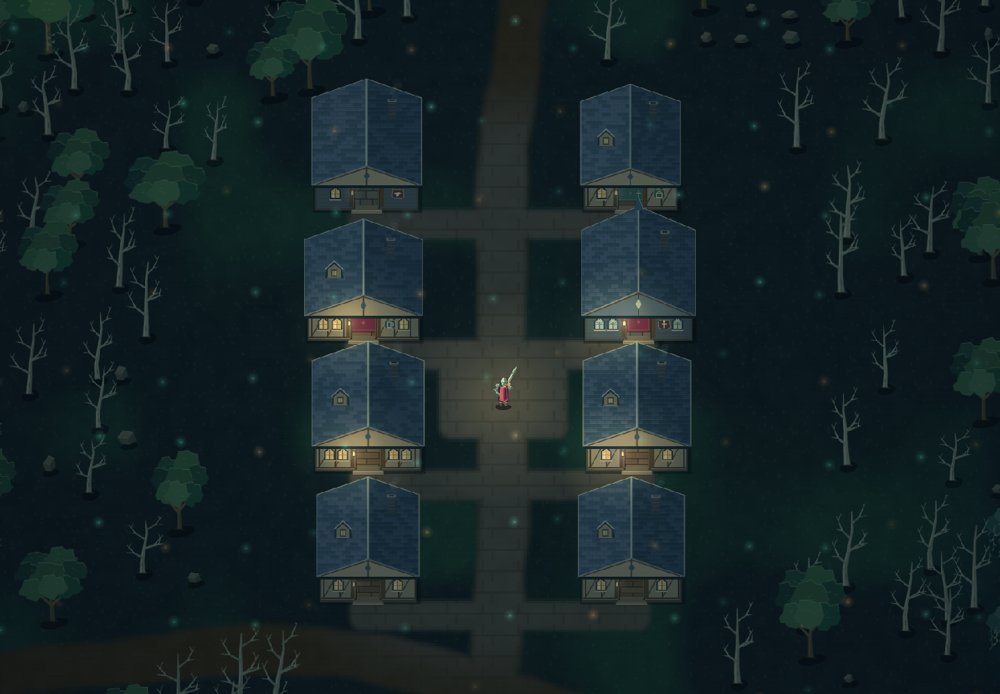
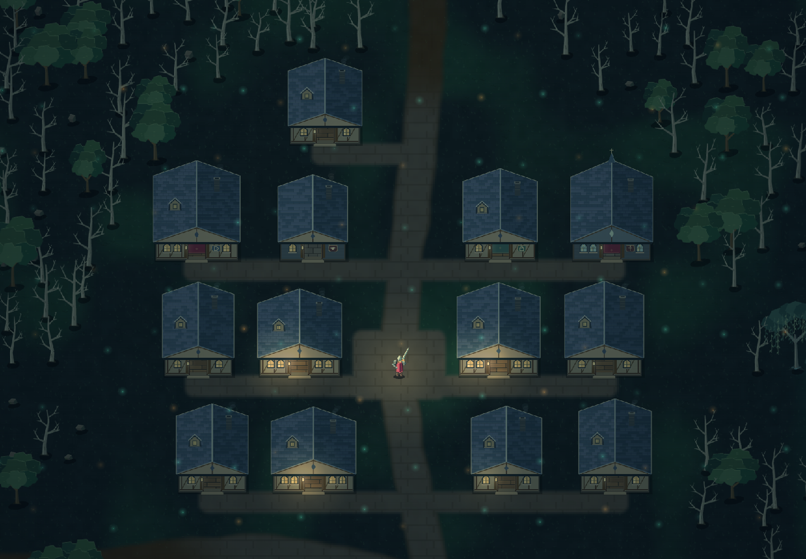
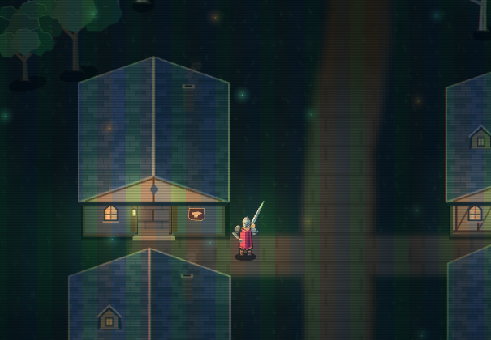
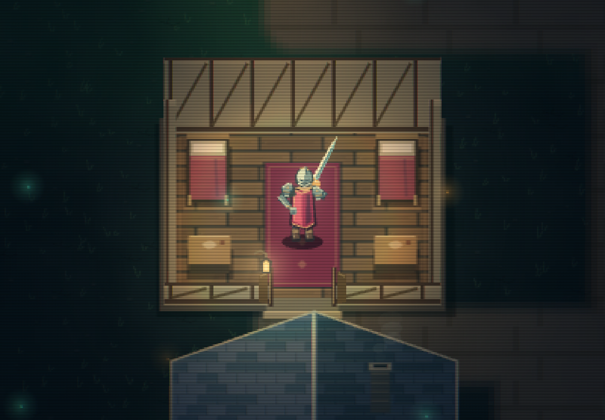

# Settlement captures · 2026-09-05

Actual generated scenes exported from the Codex in-app browser at 1440 × 1000. Seed **7319**, world generation **3**. The local review page uses the same terrain, building geometry, character, lighting, and renderer as the game. It stages a frozen character without advancing combat or writing exploration data. These are renderer captures, not concept art.

Buildings are 144–186 world units wide and 116–151 deep, with 42-unit doorways. Main roads and local streets share cobblestones with rounded shoulders; the paving fades into dirt outside town. Services have furnished interiors but no trading yet.

## Briarwatch · eight buildings

Town overview in Clean mode, showing the layout without a display filter. Follow the starting road north; the town center is at Y = -1150.

## Mournbridge · thirteen buildings

Northern city overview in Clean mode. Its inner and outer blocks share access streets and the central road; the center is at Y = -4350.

## The Ember Forge · street connection

Close view in CRT mode, showing the enlarged building beside the equipped character and the continuous road junction.

## The Lantern Inn · interior

Close view in CRT mode, with the roof automatically hidden around the staged character. Floors, furniture, doorway, and surrounding streets share world coordinates.

Open these layouts using the local dev-only [layout review](http://127.0.0.1:5173/layouts.html), select a view, then use **Save PNG**. The viewer now uses the game's fixed CRT/soft-phosphor presentation; the images above retain the earlier display treatments recorded in their captions. The camera is pulled back for overviews; these are not a replacement for the user's gameplay testing.
