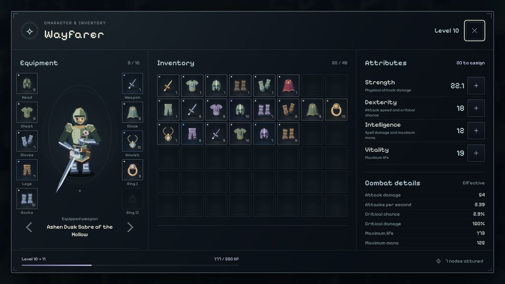
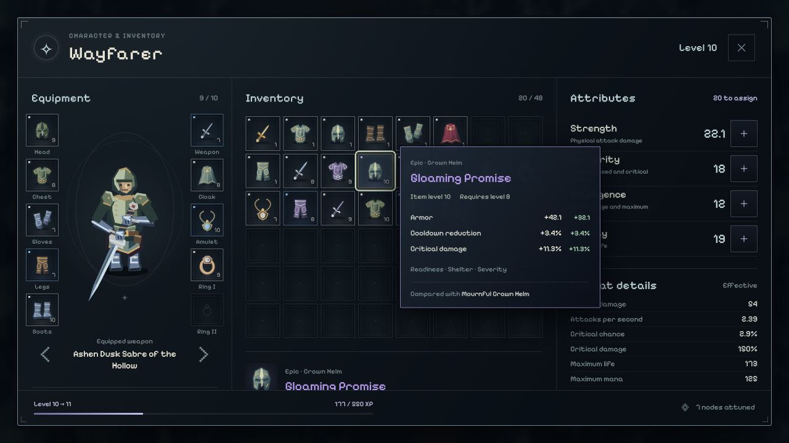
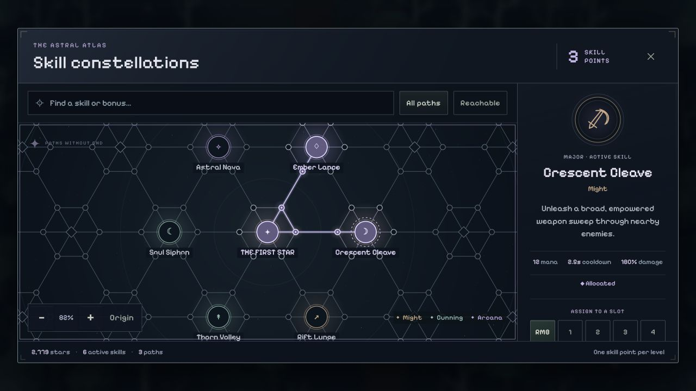

# Character systems captures

Captured in the Codex in-app browser from the real development-only character review. Level-10 gear and allocated paths are staged for inspection; these captures do not show a played run or a new character’s starting equipment. No combat was driven and no saves were accessed. The playable game starts with four spare items, neutral worn gear, and five empty skill slots.

At this 1280×720 viewport, the armory keeps its header and footer visible while each content column scrolls independently. The atlas inspector scrolls to the active skill loadout.
