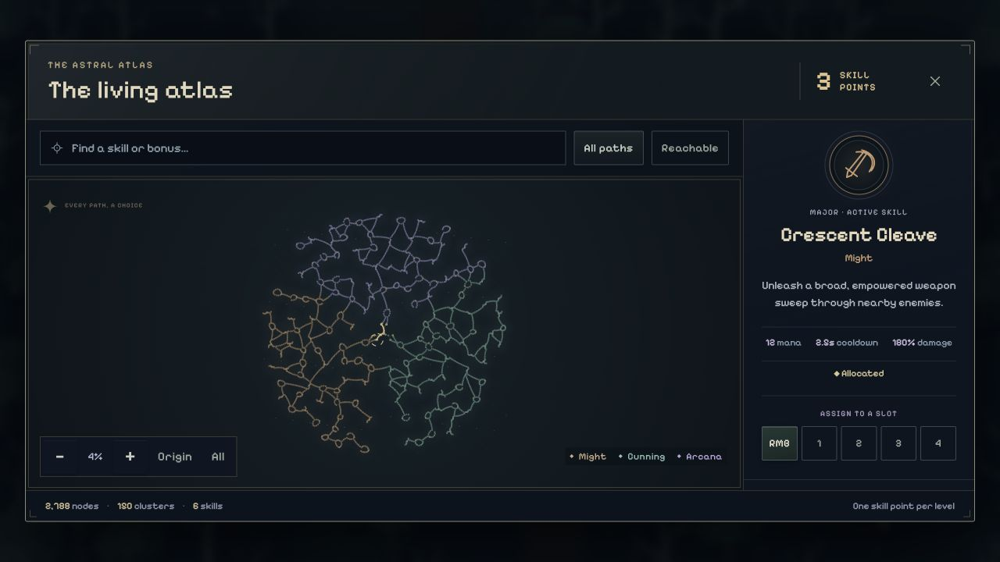
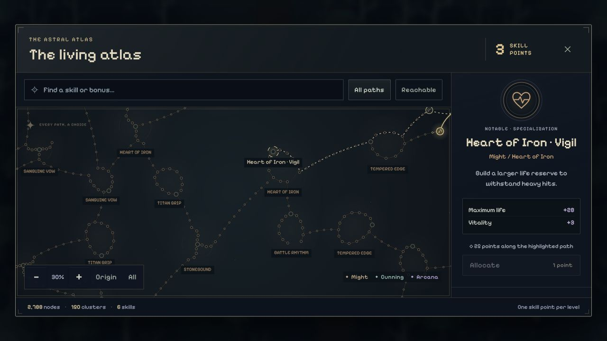
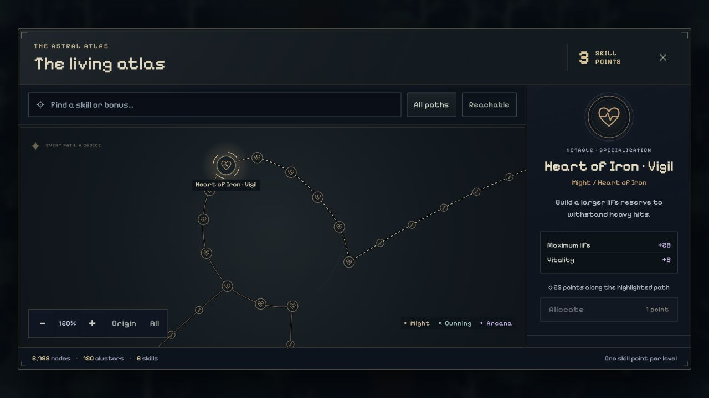

# Organic skill atlas · 2026-09-05

Actual UI captures from the Codex in-app browser at its default 1280×720 viewport. The dev-only character review stages a level-10 character with Cleave and Ember unlocked and three unspent skill points. It uses the live graph, native atlas painter, and shared inspector; no gameplay ticks or saved-character data are involved.

- **Overview:** `/character.html?panel=skills&zoom=overview`, approximately 4% zoom. The complete 2,788-node, 150-cluster graph.
- **Region:** `/character.html?panel=skills&zoom=region`, 30% zoom. Might specialties, curved connecting paths, and a proposed route to Heart of Iron.
- **Detail:** `/character.html?panel=skills&zoom=detail`, 120% zoom. The life-specialty loop, engraved heart icons, notable, and shortest-path cost.

The dashed route is a preview, not an allocation or a claim that the staged character owns those nodes. Point spending continues to validate one connected node at a time.

