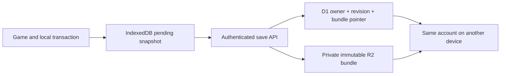

# ChatGPT cloud saves on Sites

Feasibility study · 2026-09-06 · **Proposed, not implemented or deployed.**

## Decision

Yes: visitors can sign in with ChatGPT and recover their eight characters on another browser/device using the same Evergrow Site. Keep anonymous play available, with cloud persistence as an explicit signed-in feature. Sites documents optional public-site sign-in, server-side identity and D1/R2 persistence. [Official Sites guide](https://learn.chatgpt.com/docs/sites#add-sign-in-with-chatgpt).

Read-only inspection confirmed the existing Evergrow project is active and public at **https://evergrow.dimillian.chatgpt.site**, with a configured authentication client. The local hosting manifest currently deploys only `dist`; the game has no cloud-save API, database binding or sign-in UI. Configured identity infrastructure alone does not make current saves cloud-backed.

## Player experience

- The hall gains **Sign in with ChatGPT**, then the signed-in character roster. Eight slots belong to each account.
- Open Evergrow on Safari, Chrome, a phone, or another computer; sign in to the same account and continue from its latest **Synced** checkpoint.
- Anonymous play remains device-local and labeled **Local**. Signing in never silently overwrites cloud characters with local characters.
- If this browser has local characters, offer an explicit import into free cloud slots, showing character name, level, power and last save. Preserve the local source until the cloud copy is confirmed.
- Keep status compact: **Synced**, **Saving…**, **Offline** or **Conflict**. Full explanations belong in the hall when action is required.
- Current Safari localhost saves cannot be read from the hosted domain. Deliver export/import alongside cloud saves to transfer these deliberately; do not attempt to inspect unrelated browser storage.

“Any client” means browsers/devices visiting this same Site. A native app, another Site, or localhost requires a separate supported authentication/integration flow. Sites user IDs are stable per user per Site, not a global ChatGPT identity shared between arbitrary deployments.

## Integration

Retain Vite, Canvas/WebGL and the current simulation. Add a Sites-compatible Worker serving the static game plus `/api/*`; no framework or game-engine rewrite. Add logical D1 and R2 bindings through the existing hosting project when implementation/deployment is authorized.

Sites owns `/signin-with-chatgpt`, `/signout-with-chatgpt` and `/callback`. Start sign-in with top-level browser navigation, never fetch/XHR or an app-owned OAuth implementation. The server obtains the user from the platform's trusted `oai-authenticated-user-id` header. No browser-submitted user ID, email or slot-owner field can authorize access. Missing identity returns 401 on save APIs. The platform-specific ID/header contract was verified in the installed Sites authentication reference; recheck it against the deployed dispatch path during implementation.

Use the existing `CharacterRepositoryPort` for roster/save operations. Add an explicit synchronization coordinator/outbox; do not hide network failures or conflicts inside `SaveClient`. The current IndexedDB worker remains useful for low-latency local transactions and crash recovery. The server is the authority for the latest shared checkpoint, not for combat simulation.

## Data and publication protocol

D1 holds ownership, eight slot pointers, summary fields, schema/world version, revision and active-session lease. R2 holds private immutable checkpoint bundles, including character state **and its explored chart at the same captured revision**. Large payloads should not live in one SQL row. The platform supports D1 for structured progress and R2 for blob storage. [Storage documentation](https://learn.chatgpt.com/docs/sites#choose-a-supported-site-shape).

Suggested API:

| Route | Responsibility |
| --- | --- |
| `GET /api/me` | Optional identity and sync capabilities |
| `GET /api/characters` | This user's eight slot summaries and revisions; never fetch every full save for the hall |
| `POST /api/characters` | Create/import into a free owned slot using an idempotency key |
| `GET /api/characters/:id` | Read the authorized committed bundle and revision |
| `PUT /api/characters/:id` | Validate, then publish using expected revision, session lease and idempotency key |
| `POST /api/characters/:id/session` | Acquire/renew a single-writer lease; explicit takeover handled separately |
| `DELETE /api/characters/:id` | Revision-checked deletion/tombstone; a stale device cannot resurrect the character |

Write sequence:

1. Authenticate and verify ownership, schema, finite values, point budgets, item uniqueness, world identity and body bounds using shared headless validators. Validate the chart against the same character/world.
2. Upload a new immutable bundle under a server-generated private key. Never overwrite the current object.
3. Atomically compare the expected D1 revision/lease and publish the new pointer, summaries and idempotency receipt. Zero matched rows means conflict; no last-writer-wins overwrite.
4. Only after that commit acknowledge **Synced**. Retry of the same operation/body returns its committed result; a reused key with a different body is rejected.
5. Retain the preceding valid version for recovery. Garbage-collect unreferenced failed-upload objects and expired backups after a grace period; never delete referenced bundles during publication.

R2 and D1 are not one cross-service transaction. Upload-before-pointer-publication makes the D1 pointer the commit boundary: failed uploads/pointer changes leave the old save readable; abandoned blobs are cleanup work, not lost progress. Server reads resolve only committed, owned pointers.

## Sync, conflicts and performance

Do not put a network round trip inside every combat reward or equipment action. Commit these to the existing local transaction first, then enqueue one immutable snapshot. Serialize uploads per character; coalesce superseded periodic snapshots. Flush on safe checkpoints, pause and return to hall. Page exit is best effort, so “Synced” must reflect an acknowledged server revision, not a queued request.

A short renewable server lease prevents two online clients from playing the same character as concurrent writers. A second device can view the roster and request explicit takeover. Lease expiry lets a disconnected client lose write ownership; revision checks still prevent its old progress from overwriting a newer device. Offline play may continue locally, clearly marked unsynced. On reconnect, upload only if the base revision still matches. Otherwise offer to keep the server character or recover the local branch into a free slot. **Never merge gold, XP, items, claims or dungeon state field by field.**

Start with compressed full bundles and measure real upload/validation latency. Cap compressed and expanded sizes; reject decompression bombs before parsing. Later divide world history/chart into immutable regional pages, with a committed manifest referencing all pages. Deltas must preserve the same single-revision ownership and reward invariants. Compression alone is not a substitute for bounded main-thread snapshots.

Same-origin APIs use platform authentication; require a same-origin write/CSRF policy, `Cache-Control: no-store` on private responses, ownership checks for every object access, and per-user request/body limits. Client saves remain editable by their owner: shared schema validation is not anti-cheat or server-authoritative combat. That is adequate for the current solo prototype, not competitive leaderboards.

## Delivery and acceptance

1. Build and locally test Worker auth boundary, D1 ownership/revision schema and R2 immutable bundles; use fake identities only in test/local adapters, never public request fallbacks.
2. Add the sign-in hall, explicit local import/export, outbox and conflict UX. Keep current local play working.
3. Test two users for isolation, same user on two clients, stale leases/revisions, retried writes, failed object uploads, failed pointer commits, corrupt payloads, account switching, deletion and backup recovery. Verify character/chart commit consistency.
4. Prepare a reviewable Sites version and deploy when requested. Then verify actual ChatGPT sign-in and cross-device save/resume with the user; this research has not exercised that live flow.

Platform checks still needed during implementation: preview-versus-live storage/auth isolation, exact Worker artifact integration with this Vite project, upload limits, runtime CPU/memory for long saves and actual sign-in cookies across supported browsers. Existing public access and the hosting project must be preserved. No manifest changes, credentials, database provisioning or deployment were made for this study.
