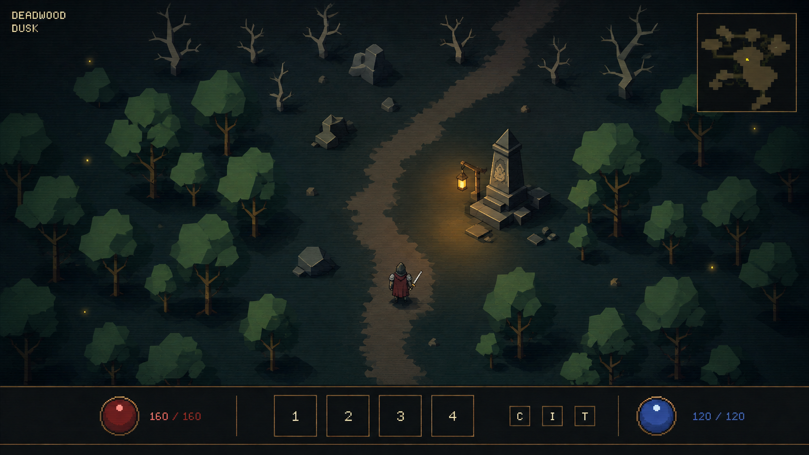
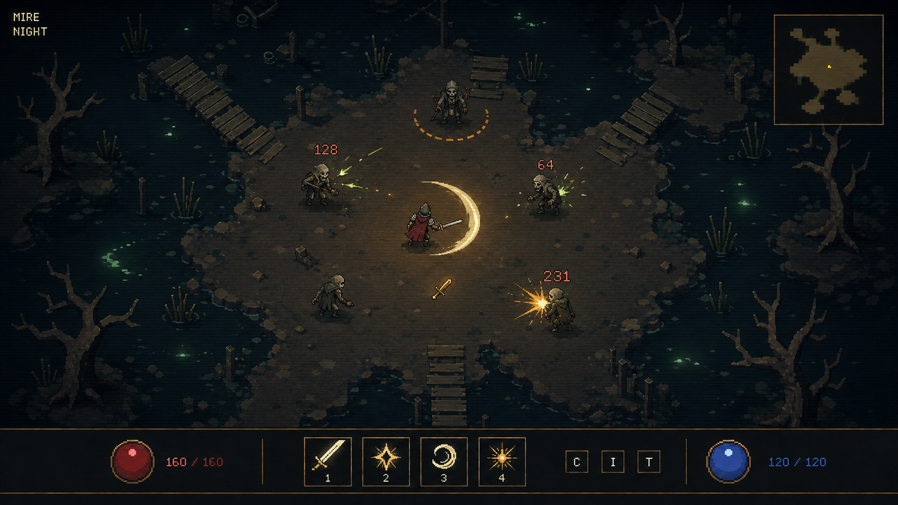
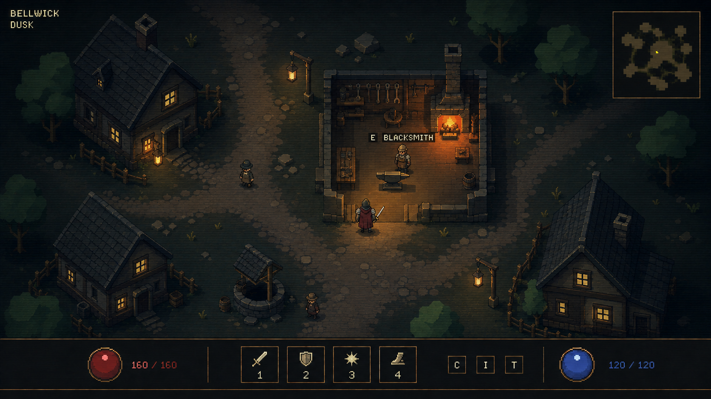
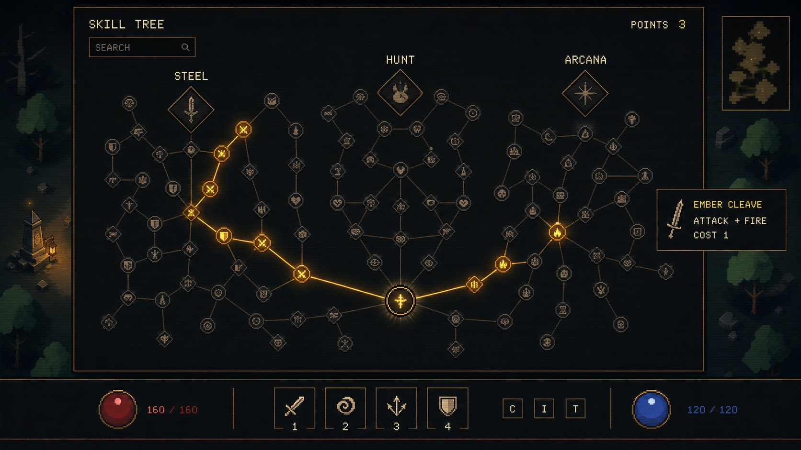

# Evergrow — retro procedural concept gallery

Created 2026-09-04 with the **built-in imagegen tool**. Four game states explore the user's direction: top-down procedural graphics, a retro appearance, pixel typography, pixel-art-adjacent shapes, and CRT/phosphor effects.

These images are visual references for code-authored geometry, materials, animation, and shaders. They are not sprite sheets or proof of a working renderer. The [art-direction notes](../retro-art-direction.md) describe the small playable scene that should validate this look.

## 1. Forest exploration at dusk

**Build vocabulary:** tapered branch segments, overlapping canopy polygons, a broad path mask, two-tone stones, a layered avatar, a radial lamp pool, and a restrained full-screen retro pass. Green canopy gradually gives way to exposed dead branches.

This is the simplified second pass. The [initial study](studies/forest-detailed-first-pass.png) had too much ground and foliage microdetail; the revision establishes the preferred economy of shapes. The empty skill slots are placeholders in this exploration image, not a final skill-bar design.

## 2. Swamp combat at night

**Build vocabulary:** connected water/land masks, repeated plank strips, reed fans, small enemy rigs, a swept sword-arc shape, short particle bursts, ground-warning arcs, and pooled bitmap damage labels. Reserve the brightest contrast for the player action and enemy tells.

The pale green water accents explore phosphor-like emission while the amber attack preserves a clear focal point. Ground texture should become a sparse reusable material mask in the prototype; it does not require drawing each speck by hand.

## 3. Village and blacksmith interior

**Build vocabulary:** building footprints, repeated roof strips, short wall segments, anvil/bench/furnace shapes, window rectangles, and local light pools. The workshop occupies its actual footprint, with an open doorway connecting directly to the street.

This still depicts the roof after its reveal. A playable prototype must demonstrate the fade and continuous movement across the threshold. The surrounding houses lean toward an elevated view; test flatter roof/side-wall proportions to settle one consistent top-down camera. Fine masonry and tool detail should be reduced to reusable patterns.

## 4. Skill-tree planning

**Build vocabulary:** circles and diamonds, reusable tiny glyphs, graph edges, selection rings, a softly glowing allocated route, bitmap labels, and plain panels. This is a local tree view; thousands of nodes belong in a pan-and-zoom graph with selective labels.

The image establishes presentation, not the final graph topology or balance. Region names, node connections, selected-state symbols, and tooltip content must come from actual tree data. Pixel type and thin edges should remain sharp when the world shader is enabled.

## Prompt record

- [Initial prompt set](prompts.json): the exact first scene prompts, including the forest's original generation.
- [Forest refinement prompt](forest-refinement-prompt.txt): the exact edit used to simplify the first forest study into the final image.
- [Final state prompts](final-state-prompts.json): the exact swamp, village, and skill-tree prompts, each referencing the simplified forest as a style guide.

All four final PNGs are saved beside this file. The original forest study is retained under `studies/` to make the refinement understandable. No CLI/API fallback was used.
