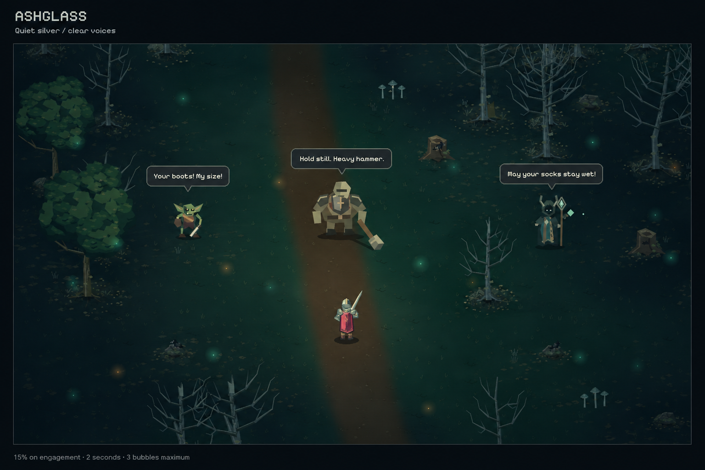
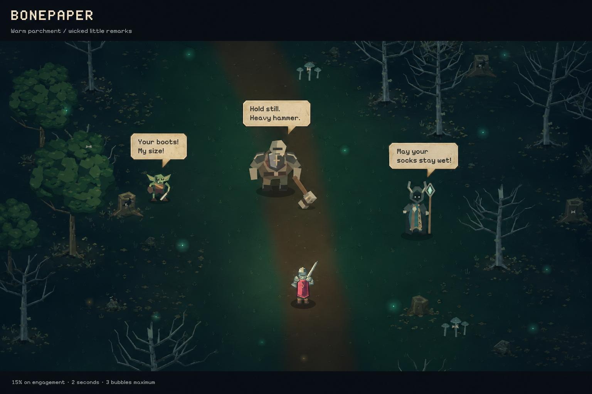
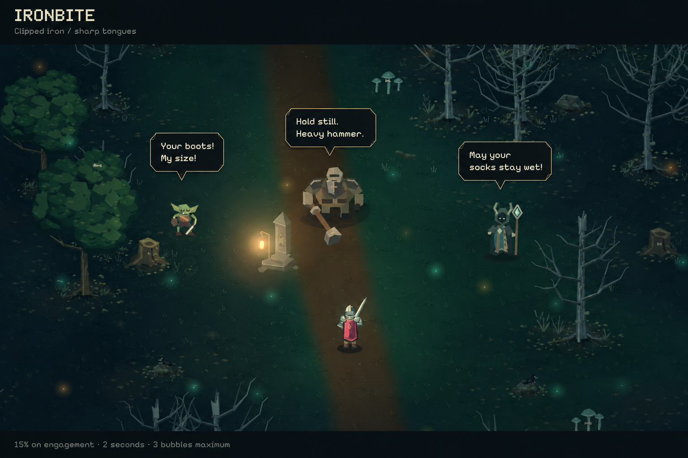
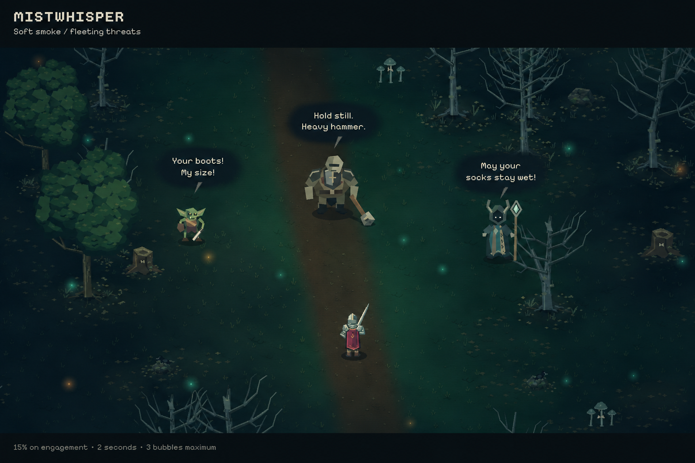

# Battle-bark visual directions

2026-09-07. Four independent built-in ImageGen concepts, ordered as displayed in the design conversation. Based on actual runtime model captures; generated scenes are illustrative, not exact game renders. No runtime integration yet. See the [full proposal, cast direction and 140 barks](../../battle-barks.md) and [exact prompts/reference paths](prompts.md).

All four compare Scrap Goblin, Gravebound Brute and Mire Hexer with identical dialogue. The seven-speaker voice plan covers the other humanoids separately. Each battlefield shows exactly three bubbles to illustrate the ceiling, not the expected frequency. Titles and policy footers are review annotations only.

## 1. Ashglass

## 2. Bonepaper

## 3. Ironbite

## 4. Mistwhisper

## Review notes

All four preserve recognizable goblin, hammer-brute and antlered hexer silhouettes and readable, correctly spelled dialogue without covering their bodies. ImageGen varies battlefield composition and some model details; selected implementation must use the original procedural renderer. Bubble scale and placement are illustrative; use the proposal's measured native-pixel bounds in implementation. Mistwhisper's pale tails are more detached than intended: connect them to the smoky body if selected. The other three have clearer speaker attachment. None of these static concepts validates moving collisions or actual combat readability.
